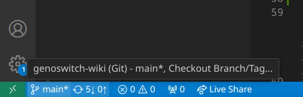
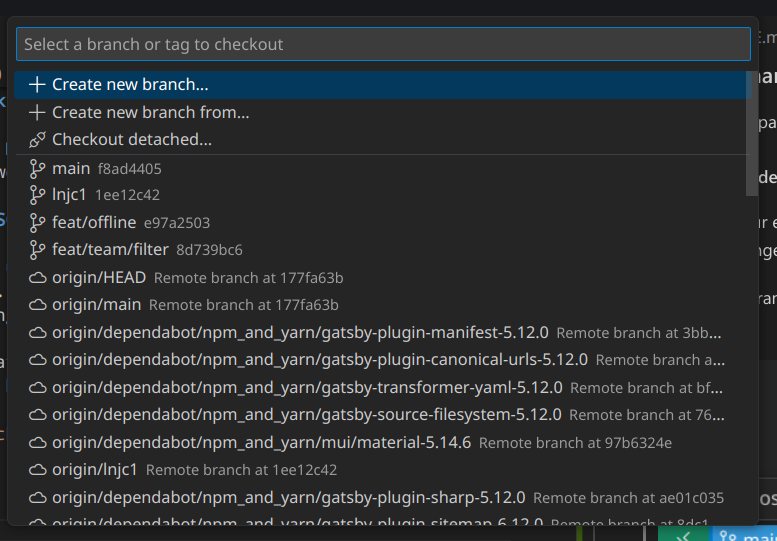
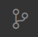
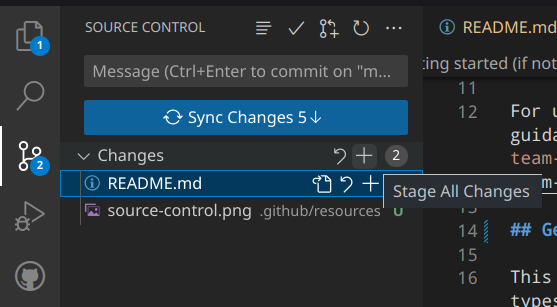

# Team City-of-London-UK 2023 Wiki

>)

## Preface

This repository **MUST** contain all coding assets to generate your team's wiki (HTML, CSS, JavaScript, TypeScript, Python, etc).

Images, photos, icons and fonts **MUST** be stored on `static.igem.wiki` using [uploads.igem.org](https://uploads.igem.org), and Videos **must** be embedded from [iGEM Video Universe](https://video.igem.org).

For up-to-date requirements, resources, help and guidance, visit [competition.igem.org/deliverables/team-wiki](https://competition.igem.org/deliverables/team-wiki).

## Getting started (if not using GitHub Codespaces)

This Wiki is built using [TypeScript](https://typescriptlang.org/), [React](https://react.dev/), and [Gatsby](https://gatsbyjs.com).

1. Install [Node.js](https://nodejs.org/en/download)

2. Install [Git](https://git-scm.com/downloads)

3. Clone (download) the repository

   `git clone https://2023.igem.wiki/city-of-london-uk/`

   or

   `git clone https://github.com/genoswitch/wiki`

4. `cd` into the wiki directory

5. Install dependencies with `npm i --no-scripts`

6. Done! You can preview your changes in real time by running `npm start`.

## Getting started (using GitHub Codespaces)

Welcome to your codespace! You may need to wait a few minutes while everything is set up.

Your codespace allows you to access a development version of the site, containing any changes you make within the codespace. To access it, go to the **Ports** tab, find the **Hot Reloading** entry. There is a link under the **Local Address** column. Hold down Control and click to to access your development version of the wiki.

When you make a change, save the file, wait a few seconds and then refresh the wiki page. Your new change should now be visible.

### Making changes

Simple MDX pages are stored in /pages/mdx. Edits can be viewed in real-time.

To set up your environment, we want to create a new branch. This allows you to make changes while allowing others to do the same.

To create a branch, click the button labelled "main" in the bottom left of the screen.

A dialog box will open with a list of all currently active branches. Click the **Create new branch...** button.

Then type in the name of your new branch (we recommend something like `(yourname)/(what you're working on)`, for example `james/team-page`) and press Enter to confirm. You are now on the next branch.

You can now start making your edits/changes!

### Saving your changes

When you have made your edits, click the source control button **on the top left of the screen**. This will open the source control sidebar on the left of the screen.

Then ensure all of your changes are **staged** by clicking the + sign to the right of _Changes_. This **stages** your changes, meaning that they will be included when you commit (add to) the repository.

Next, write a descriptive message in the message box. You will notice that the **Sync Changes** button will change to a **commit** button. Click the button to commit your changes.

Finally, we need to **push** your changes.

If you have changes to commit, the button will either say **Publish Branch** or **Sync Changes** (with a number). Ti sync / publish your branch. Click the button.

If you are prompted for a remote to use click **origin**.
If you are prompted to create a fork, please create one.

> More information about branches in Git can be found [here](https://docs.github.com/en/pull-requests/collaborating-with-pull-requests/proposing-changes-to-your-work-with-pull-requests/about-branches).
